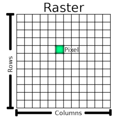

# Concept Note

This technical note describes the concept of the `titiler-openeo` project.

## Overview

The main goal of this project is to provide a light and fast backend for openEO services and processes using the same features as the TiTiler engine:

- Built on top of FastAPI
- Cloud Optimized GeoTIFF support
- SpatioTemporal Asset Catalog support
- Multiple projections support (see TileMatrixSets) via morecantile.
- JPEG / JP2 / PNG / WEBP / GTIFF / NumpyTile output format support
- XYZ service support
- Automatic OpenAPI documentation (FastAPI builtin)

## Data Model

In openEO, a datacube is a fundamental concept and a key component of the platform. Data is represented as datacubes in openEO, which are multi-dimensional arrays with additional information about their dimensionality.
Datacubes are powerful but can also be heavy to manipulate and often requires asynchronous processing to properly process and serve the data.
Unlike most of the existing openEO implementation, `titiler-openeo` project simplifies this concept by focusing on image raster data that can be processed on-the-fly and served as tiles or as light dynamic raw data.

### Raster with ImageData

In order to make the processing as light and fast as possible, the backend must manipulate the data in a way that is easy to process and serve.
That is why most of the processes use [`ImageData`](https://github.com/developmentseed/titiler-openeo/blob/43702f98cbe2b418c4399dbdefd8623af446b237/titiler/openeo/processes/data/load_collection_and_reduce.json#L225) object type for passing data between the nodes of a process graph.
[`ImageData`](https://cogeotiff.github.io/rio-tiler/models/#imagedata) is provided by [rio-tiler](https://cogeotiff.github.io/rio-tiler/) that was initially designed to create slippy map tiles from large raster data sources and render these tiles dynamically on a web map.

### Reducing the data

The ImageData object is obtained by reducing as early as possible the data from the collections.
While the traditional [`load_collections` process](https://github.com/developmentseed/titiler-openeo/blob/43702f98cbe2b418c4399dbdefd8623af446b237/titiler/openeo/processes/data/load_collection.json#L2) is implemented and can be used, it is recommended to use the `load_collection_and_reduce` process to have immediately an `imagedata` object to manipulate. The `load_collection_and_reduce` process actually apply the [`apply_pixel_selection`](https://github.com/developmentseed/titiler-openeo/blob/main/titiler/openeo/processes/data/apply_pixel_selection.json) process on a stack of raster data that are loaded from the collections.

