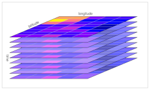

# Concept Note

## Context

openEO serves as an abstraction layer for Earth Observation (EO) processing and has gained significant traction within the community. Several data hubs now offer openEO as a service, notably the [Copernicus Data Space Ecosystem](https://dataspace.copernicus.eu/analyse/openeo), [Terrascope](https://terrascope.be), and [EODC](https://openeo.cloud/). Additionally, [EOEPCA+](https://eoepca.readthedocs.io/projects/processing/en/latest/design/processing-engine/openeo/), with its processing building block, is furthering the deployment of openEO.

To enhance the value of openEO as an abstraction for essential services like STAC-based data collections, data processing methods, visualization services, and compute infrastructure, it is necessary for more commonly used raster processing and visualization services to provide an openEO interface. For instance, the [openEO Sentinel Hub driver](https://github.com/Open-EO/openeo-sentinelhub-python-driver) allows users to interact with Sentinel Hub features via an openEO interface. 

Moreover, [TiTiler](https://github.com/developmentseed/titiler) facilitates dynamic tiling of STAC raster datasets and OGC Features, serving as a core component of eoAPI, Development Seed's open-source, interoperable EO data services stack.

In this context, [Development Seed](https://developmentseed.org/) presents its own implementation of openEO, featuring a fast and lightweight solution to efficiently manage raster-based processes.

## Overview

The main goal of this project is to provide a light and fast backend for openEO services and processes using the same features as the TiTiler engine:

- Built on top of FastAPI
- Cloud Optimized GeoTIFF support
- SpatioTemporal Asset Catalog support
- Multiple projections support (see TileMatrixSets) via morecantile.
- JPEG / JP2 / PNG / WEBP / GTIFF / NumpyTile output format support
- XYZ service support
- Automatic OpenAPI documentation (FastAPI builtin)

## API

The application provides with [openEO API (L1A and L1C)](https://openeo.org/documentation/1.0/developers/profiles/api.html#api-profiles).

### Synchronous Processing (L1A profile)

The synchronous processing endpoints aim at processing and downloading data synchronously.
The `POST /results` executes a user-defined process directly (synchronously) and the result is downloaded in the format specified in the process graph.
This endpoint can be used to generate small previews including few data sources (typically tiles) or test user-defined processes before starting a batch job.
Timeouts on either client- or server-side are to be expected for complex computations.
Back-ends MAY send the openEO error ProcessGraphComplexity immediately if the computation is expected to time out.
Otherwise requests MAY time-out after a certain amount of time by sending openEO error RequestTimeout

### Secondary Web Services (L1C profile)

The set of secondary web services endpoints aims to provide data visualization with dynamic tiling according to a process graph submitted or available in the API.

## Data Model

In openEO, a datacube is a fundamental concept and a key component of the platform. Data is represented as datacubes in openEO, which are multi-dimensional arrays with additional information about their dimensionality.
Datacubes are powerful but can also be heavy to manipulate and often requires asynchronous processing to properly process and serve the data.
Unlike most of the existing openEO implementation, `titiler-openeo` project simplifies this concept by focusing on image raster data that can be processed on-the-fly and served as tiles or as light dynamic raw data.

### Raster with ImageData

In order to make the processing as light and fast as possible, the backend must manipulate the data in a way that is easy to process and serve.
That is why most of the processes use [`ImageData`](https://github.com/developmentseed/titiler-openeo/blob/43702f98cbe2b418c4399dbdefd8623af446b237/titiler/openeo/processes/data/load_collection_and_reduce.json#L225) object type for passing data between the nodes of a process graph.
[`ImageData`](https://cogeotiff.github.io/rio-tiler/models/#imagedata) is provided by [rio-tiler](https://cogeotiff.github.io/rio-tiler/) that was initially designed to create slippy map tiles from large raster data sources and render these tiles dynamically on a web map.

### Reducing the data

The ImageData object is obtained by reducing as early as possible the data from the collections.
While the traditional [`load_collections` process](https://github.com/developmentseed/titiler-openeo/blob/43702f98cbe2b418c4399dbdefd8623af446b237/titiler/openeo/processes/data/load_collection.json#L2) is implemented and can be used, it is recommended to use the `load_collection_and_reduce` process to have immediately an `imagedata` object to manipulate. The `load_collection_and_reduce` process actually apply the [`apply_pixel_selection`](https://github.com/developmentseed/titiler-openeo/blob/main/titiler/openeo/processes/data/apply_pixel_selection.json) process on a stack of raster data that are loaded from the collections.

## Collections

In openEO, the backend offers set of collections to be processed. `titiler-openeo` offers the possibiltiy to use external STAC API services to get the collections.
It uses [`pystac-client`](https://github.com/stac-utils/pystac-client) to proxy the STAC API and get the collections. The STAC API is configured through `TITILER_OPENEO_SERVICE_STORE_URL` environment variable.

## File formats

Since the backend is built on top of the TiTiler engine, it supports the same output formats:

- JPEG
- PNG

## Processes

`titiler-openeo` supports a set of processes that can be used in a process graph. There are mostly focused on raster processing.

### Load Collection

The `load_collection` process is used to load a collection from the STAC API. In `titiler-openeo`, it also returns a `Datacube` object type that needs to be reduced to an [`ImageData`](.#reducing-the-data) object type to be used with most of the other process.

## General limitations

The backend is designed to process and serve raster data that can be processed on-the-fly and served as tiles or as light dynamic raw data. So as a rule of thumb, bigger the initial extent of the data to process, the longer the processing time will be and thus may lead to timeouts.

Since titiler-openeo does not require any other middleware to be deployed, it can be easily replicated and scaled.